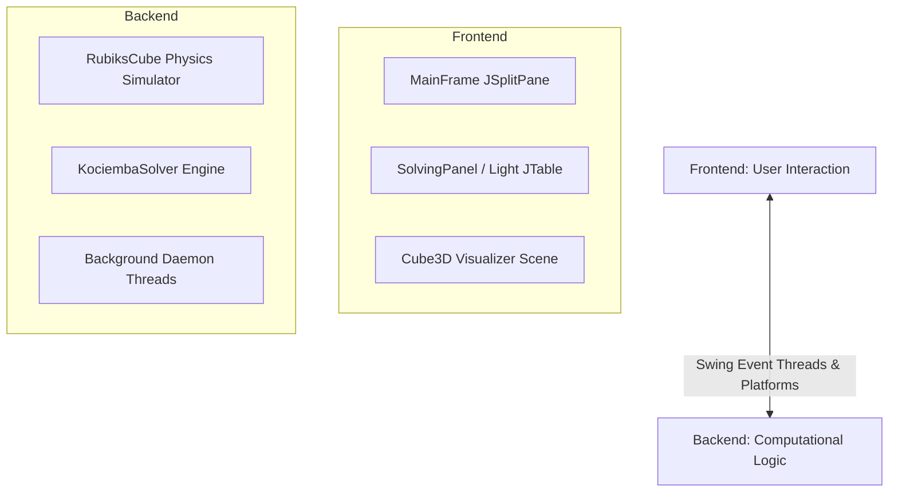

# Rubik's Cube Solver (PRO)

An interactive, high-precision desktop application that simulates and solves any valid Rubik's Cube configuration using advanced 3D visualization and optimal mathematical solving algorithms.

---

## 1. Project Overview
This project is an **Interactive 3D Rubik's Cube Solver** designed to make learning and solving the Rubik's Cube easy, engaging, and highly visual. 

### The Problem It Solves:
For beginners, standard Rubik's Cube text guides or 2D diagrams can be confusing and hard to follow. This application solves that problem by:
1. Allowing users to enter their exact real-world cube colors or load legendary preset scrambles.
2. Generating an **optimal step-by-step solving sequence** in under a second.
3. Displaying an **interactive 3D model** alongside a clear, guided checklist so users can visually follow every rotation.

---

## 2. Main Features
* **Optimal Solver**: Integrates the mathematical **Kociemba Two-Phase Algorithm** to solve any scrambled state in under 21 moves.
* **Dual-Panel Interface**: A split screen consisting of a light-themed interactive guide on the left and a dark-themed high-contrast 3D visualization canvas on the right.
* **Interactive 3D View**: Real-time 3D rendering with mouse drag rotation support, letting you inspect the cube from any angle.
* **Step-by-Step Guide**: Includes a light-themed interactive Move List table that highlights the active rotation, auto-scrolls to keep you centered, and places green checkmarks next to completed steps.
* **MacOS Sizing Adaptability**: Designed with dynamic proportional weights (50%-50% split) and zoom scaling so the 3D visualizer never clips or disappears.
* **Instant Presets**: Features one-click presets for classic scrambles, Checkerboard patterns, and the famous edge-flipping *Superflip* configuration.
* **Fail-Safe Robustness**: Embedded platform-detection boundaries that handle computers lacking hardware-accelerated 3D graphics elegantly, letting the core application remain 100% active.

---

## 3. Project Architecture
The project is built on a clean, modular architecture split into two core divisions:



### 1. Frontend (UI / User Interaction)
Manages the visual presentation, user inputs, buttons, tables, and 3D graphics rendering:
* Built with **Java Swing** for structural window containers, navigation grids, and custom rounded styled cards.
* Embedded with **JavaFX (`JFXPanel`)** to initialize a hardware-accelerated 3D rendering loop, camera matrices, and rotation animations.

### 2. Backend (Logic / Processing)
Handles the mathematical calculations, logical cube states, and asynchronous task management:
* **Cube Physics State**: Simulates the 54 facelet array and calculates physical piece translations during rotations.
* **Solving Engine**: Runs Kociemba's double-phase optimization algorithm to solve the state.
* **Daemon Concurrency**: Runs calculations on dedicated backend threads to keep the user interface smooth and responsive.

---

## 4. Simple Project Flow (Viva-Friendly)
Here is how data moves through the application step-by-step:

```
[ User Inputs Colors / Presets ]
             │
             ▼ (Frontend)
[ Click "SOLVE CUBE" Button ]
             │
             ▼ (Asynchronous Thread)
[ Backend: Kociemba Solver Runs ]
             │
             ▼ (Generates Optimal Moves List)
[ UI Table Populates & Updates Guide ]
             │
             ▼ (Interactive Playback)
[ User Clicks Next/Prev to Rotate 3D Cube ]
```

1. **Input Phase**: The user types color sequences into the input fields or clicks a preset button on the Frontend.
2. **Request Phase**: The user clicks **SOLVE CUBE**. The Frontend launches a background thread and sends the current color state to the Backend.
3. **Processing Phase**: The Backend processes the state, runs the Kociemba mathematical solver, generates a list of moves (e.g., `U`, `R'`, `F2`), and returns them.
4. **Display Phase**: The Frontend takes the returned moves list, loads it into the light-themed step table, and lets the user step through the interactive guide, updating the 3D cube colors on every transition.

---

## 5. Technologies Used
* **Primary Language**: Java (JDK 17)
* **Frontend UI**: Java Swing (Desktop framework)
* **3D Visualizer**: JavaFX 3D APIs (`PerspectiveCamera`, `Group`, `Box`, `PhongMaterial`)
* **Core Build Engine**: Apache Maven
* **Algorithm Library**: Real Kociemba Solver Engine

---

## 6. Setup & Running Instructions

### Prerequisites
* Java Development Kit (JDK) 17 or higher
* Maven installed (or use the included wrapper `./mvnw`)

### Running Locally
1. Clone or navigate to the project directory:
   ```bash
   cd adavance-rubic-s-solver
   ```
2. Build and compile the project using Maven:
   ```bash
   ./mvnw clean compile
   ```
3. Run the application:
   ```bash
   ./mvnw exec:java -Dexec.mainClass="com.carlos.ui.MainFrame"
   ```
4. To run automated verification tests:
   ```bash
   ./mvnw test
   ```

---

## 7. Presentation & Viva Split (4 Team Members)

To make presenting this project easy and organized, the explanation is divided into four distinct roles:

### 👤 Member 1: Frontend & Layout Design
* **Focus**: UI Design, user components, and user interaction.
* **What to Explain**:
  * Explain the **Dual-Theme Design**: the light-themed left panel (`SolvingPanel.java`) for high readability, and the high-contrast dark-navy right panel (`JFXPanelWrapper.java`) for premium 3D visualization.
  * Explain how colors are inputted by users and preset scrambles are loaded.
  * Showcase the custom components (e.g., `StyledButton` which ensures color consistency across macOS and Windows, and the dynamic `JSplitPane` 50%-50% display split weight).

### 👤 Member 2: Backend & Physics Logic
* **Focus**: Physics state modeling, Kociemba Solver implementation, and thread safety.
* **What to Explain**:
  * Explain **`RubiksCube.java`**: How the physics state is mapped as a 54-element array and how face rotations clock physical transitions.
  * Explain **`KociembaSolver.java`**: How the mathematical Two-Phase algorithm computes optimal solving steps in milliseconds.
  * Explain **Concurrency**: How we launch a background daemon thread during execution so that calculation delays never freeze the UI.

### 👤 Member 3: Complete Project Flow & Transitions
* **Focus**: End-to-end data flow, coordination, and step transitions.
* **What to Explain**:
  * Walk the examiners through the **Project Flow**: step-by-step from inputting a scramble to displaying the solved visual state.
  * Explain the **Interactive Navigation** (NEXT MOVE / PREV): How indices sync up when going forward or backward, updating colors and scrolling the table synchronously.
  * Explain the **Parent Containment Fix**: How we implemented a layout parent check (`getParent() != targetPanel`) to stop Swing container overlaps and ensure the 3D cube remains perfectly stable and never disappears.

### 👤 Member 4: Core Features, Integration & Future Extensions
* **Focus**: Overall system synthesis, special feature highlights, and future upgrades.
* **What to Explain**:
  * Highlight the **Visibility Zoom** (`TranslateZ` set to `-1150`) which ensures the 3D cube is fully visible on all monitor sizes without cutting off.
  * Explain **Robust Compatibility**: The fail-safe `try-catch` boundaries in `Cube3D.java` that catch hardware acceleration limits gracefully.
  * Conclude with future improvements (e.g., mobile support or camera-scanning integrations).

---

## 8. Future Improvements
* **Mobile Companion**: Porting the Swing layout to a responsive mobile app (Android/iOS).
* **AR Camera Integration**: Using a smartphone camera or webcam to automatically scan the physical cube faces and input colors automatically.
* **Offline Guides**: Exporting step-by-step solving sequences to highly legible PDF guides.
